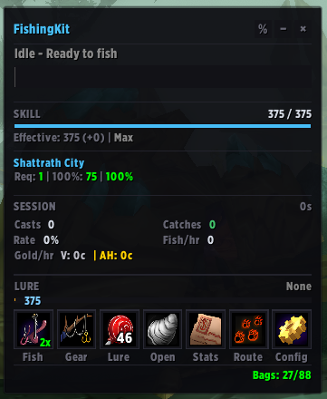
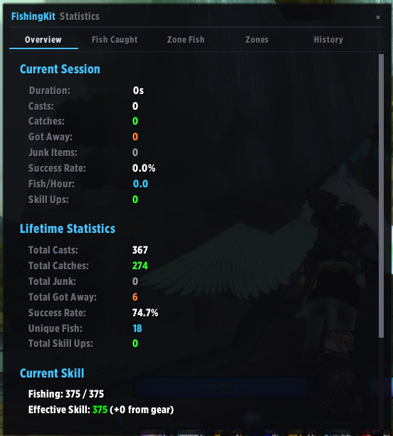
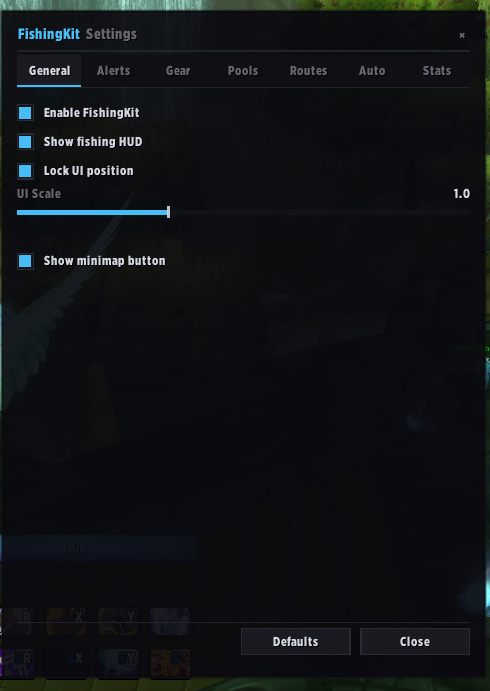

  

# Extreme FishingKit

A comprehensive fishing companion addon for WoW TBC Classic Anniversary Edition.

Fork of the original [FishingKit](https://www.curseforge.com/wow/addons/fishingkit-tbc-anniversary-edition) — all credit for the original work goes to the original author.

## Screenshots

| Main HUD | Statistics | Settings |
|:---:|:---:|:---:|
|  |  |  |

## Features

- One-click gear swap between fishing and combat sets
- Smart lure system with auto-apply and expiration timer
- Double-right-click anywhere to cast
- Auto weapon swap on entering combat, pole restored after
- Session and lifetime statistics with gold tracking (vendor + AH)
- Zone database with skill requirements and catch rates
- Pool detection with minimap and world map pins
- Pool route navigation with TomTom-style arrow
- Pre-filled database with 652 known pool spawn locations
- Bite confidence band on the cast bar
- STV Fishing Extravaganza contest tracker
- Fishing goals, catch & release, and auto-open containers
- Tooltip enrichment with catch data and AH prices
- Key bindings for all major actions
- Automatic SavedVariables backups
- Full localization support — works on all WoW client languages

## Slash Commands

| Command | Description |
|---|---|
| `/fk` | Toggle panel |
| `/fk equip` / `unequip` | Swap gear sets |
| `/fk savegear fishing` / `normal` | Save current gear set |
| `/fk stats` | Open statistics |
| `/fk config` | Open settings |
| `/fk route` | Toggle pool route navigation |
| `/fk route skip` / `nearest` | Skip waypoint / recalculate route |
| `/fk pools` | List discovered pools in current zone |
| `/fk goal <fish> <count>` | Set a fishing goal |
| `/fk release <fish>` | Auto-delete junk fish |
| `/fk import gathermate` | Import pools from GatherMate2 |
| `/fk backup` | Force a backup |
| `/fk reset stats` / `position` | Reset statistics or UI position |
| `/fk lock` / `unlock` | Lock/unlock UI position |
| `/fk scale [0.5-2.0]` | Set UI scale |

## Compatibility

- **Game version**: TBC Classic Anniversary (2.5.5)
- **Interface version**: 20505
- **Addon version**: 1.3.6